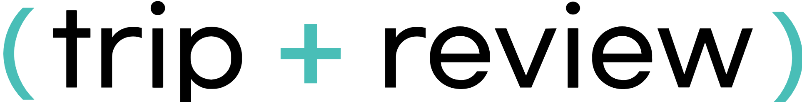

# ✈Triview-Project

 🛠**Used Framework** 
 

> ⌛**period** 2022.10.31(MON)-2022.11.8(TUE) 
> ✨여행 리뷰 사이트 구현 

## 📚index

-   📃[Description](#Description)
-   📘[Content](#content)
-   👨‍👩‍👧‍👧[Contributor](#contributor)
-   ✉[Postscript](#Postscript)

### 📃Description

⭐팀명 트리뷰는 trip+review의 합성어입니다. 
 
여행지 정보 및 후기 공유 커뮤니티 서비스를 만드는 것이 프로젝트의 목적이였기 때문에 팀명을 정하는 것에 많은 의견이 오갔습니다. 
그러다가 여행이라는 의미의 trip과 review를 같이 합쳐보는 것이 어떨까라는 의견이 나왔고, 결국 최종적으로 결정되었습니다. 
 
✍팀역할 분담에서 
 
🦄✨팀장 역할과 리뷰 기능 구현은 조본희씨가, 
🐨🌿발표자 역할과 리뷰 기능 구현에 유순일씨가, 
🐰🥕ppt 작성 역할과 프론트엔드 파트 전반과 디자인에 오채현씨가, 
🦝🍏readme 작성 역할과 회원 기능 구현에 권건희씨가, 
각각 담당해주셨습니다. 
 
📘content문단에서 본격적이고 최종적인 기능 구현에 대한 설명을 하기 전에 
📃Description문단에서 프로젝트 계획에 대한 내용을 전반적으로 서술하도록 하겠습니다. 
 
대략적인 팀 구조와 주제가 정해지고 난 후에 유사한 서비스들을 살펴보다가 
[마이리얼트립](https://www.myrealtrip.com/), [트립어드바이저](https://www.tripadvisor.co.kr/)를 참고, 분석하게 되었고, 
이것을 바탕으로 뼈대를 설계하기로 했습니다. 
그리하여 회원관리, 글 작성, 리뷰 확인으로 이루어진 기능의 큰 틀을 잡았습니다. 
그 틀을 기반으로 기능 구현과 관리의 편의성을 위해서 결정된 사항들은 아래와 같습니다.

-   DB영역
    -   Accounts
    -   Location
    -   Review
         
-   화면 설계(트립어드바이저 참조)
    -   피그마를 이용하여 와이어 프레임을 생성
    -   메인 홈 화면
    -   리뷰 작성 페이지
    -   여행 정보, 리뷰 확인 페이지

### 📘content

### 👨‍👩‍👧‍👧contributor

 🌳🌷🌼🌻🌷🌼🌻🌷🌼🌻🌷🌼🌻🌷🌼🌻🌷🌼🌻🌷🌼🌻🌷🌼🌻🌷🌼🌻🌷🌼🌻🌷🌳

### ✉Postscript

|👨‍👩‍👧‍👧조원|✏후기|
|----|----------------------------|
|🦄조본희|✨팀원분들 정말 수고 많으셧습니다! 예비군때문에 중간에 하루 자리에 없었는데도 다들 잘 진행해주셔서 감사합니다!|
|🐨유순일|🌿부족한 점이 많아서 걸림돌이 되지 않을까 걱정되었지만, 이해해주시고 알려주셔서 프로젝트 잘 마칠 수 있었습니다! 감사합니다~!|
|🐰오채원|🥕| 팀원분들 모두 맡은 역할을 잘 수행해주시고 적극적으로 프로젝트에 참여해주셔서 금방 끝난 것 같아요. 수고하셨습니다.👍 |
|🦝권건희|🍏열정있으시고 실력있으신 분들이랑 프로젝트해서 너무너무 행복했습니다! 많이 배우고 가요 정말 감사드려요!|

